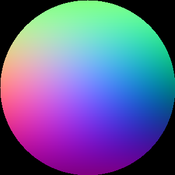

# ThreED-SynTxt
synthetic data generation for text with 3d information.
you can find our dataset [here](https://drive.google.com/drive/u/1/folders/1ED0-dJxuBDWLhW1qWxxl4wAd4gtlcXM5), if you want to generate your own dataset, please refer to the following instructions.

3D info are represent by normal vector and transfer to rgb as shown below

<p align="center">
  
</p>


## Setting up
Dataset Installation (Background images)
### Step 1
```python
git clone https://huggingface.co/datasets/BigCoco/datasets
unzip datasets/bg_data.zip -d datasets/     # remember to add datasets/bg_data to your .gitignore
```

Note that, if you failed to unzip the file, please download & unzip bg_data.zip manully.


bg_data.zip can be found [here](https://huggingface.co/datasets/BigCoco/datasets/tree/main) 

### Step 2
Run the code below to fix the sRGB problem for the background image

```python
python utils/fix_bg_img.py
```


## folders
`txt_test` modify this to txt folder by mostel train-50k, download [here](https://rec.ustc.edu.cn/share/81ddc320-b05b-11ed-b4bc-5f690f426d88) (password: t6bq)


`fonts` 70 fonts included


`Gen.py` run this for data generation to generate your training dataset
`Gen_wrap.py` run this for data generation to generate your 3D-bending (wrap) dataset

## arguments for Gen.py
| args | Description | default |
| --- | --- | --- |
| `--text_dir` | dir for text editing pair from mostel | txt_test |
| `--data_dir` | Data folder name | SynTxt3D_50K_1 |
| `--file_range` | range for train pair desired to generate in mostel | [1, 50000] |

## Output Data structure
The output data should be as follow. Be aware that we augmented the synthetic dataset by Mostel, thus for every pair in train-50k we generate 20 different 3D-rotation distribution (20 `3D arrangment`, 70 `fonts`, 3 `arc arrangment`)

`note:`Mostel Dataset can be downloaded [here](https://rec.ustc.edu.cn/share/81ddc320-b05b-11ed-b4bc-5f690f426d88) (password: t6bq)
```
SynTxt-Gen/SynTxt3D_50k_1
├── i_s
|    ├── 00001.png
|    ├── ......
|    └── 50000.png
├── mask_3d_s
|    ├── 00001.png
|    ├── ......
|    └── 50000.png
├── mask_3d_t
├── mask_s
|    ├── 00001.png
|    ├── ......
|    └── 50000.png
├── mask_t
├── t_b
|    ├── 00001.png
|    ├── ......
|    └── 50000.png
├── t_f 
|    ├── 00001.png
|    ├── ......
|    └── 50000.png
├── txt
|    ├── 00001.png
|    ├── ......
|    └── 50000.png
└── i_t.txt
```

- i_s: styled text a (src) rendering on background image

- mask_3d_s: the mask with normal vector of styled text a (src)

- mask_3d_t: the mask with normal vector of styled text b (tgt)

- mask_s: the binary mask of styled text a (src)

- mask_t: the binary mask of styled text b (tgt)

- t_b: background image w/o any txt rendering

- t_f: styled text b (tgt) rendering on background image

- txt: record every styled text a & b

- i_t.txt: a list of all imgs and it's styled text b (tgt)

## Generate Data
```python
python Gen.py --text_dir txt_text --file_range [0, 24999]
```

if you want to generate your own text pairs, see `txt_test` for example.